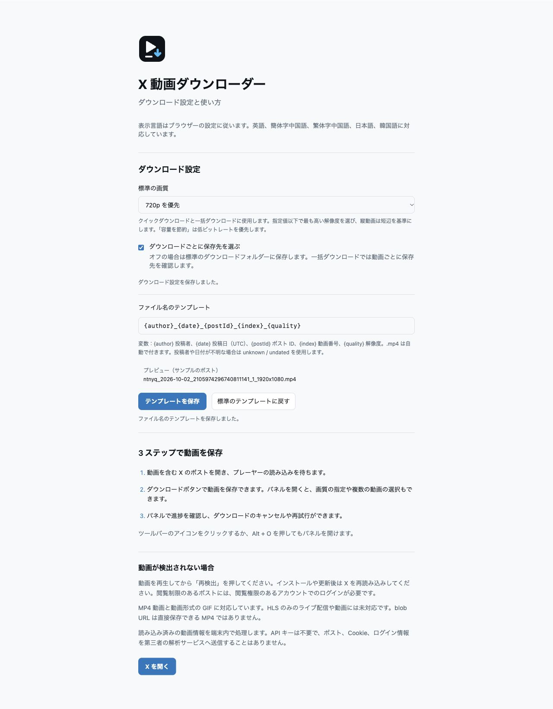
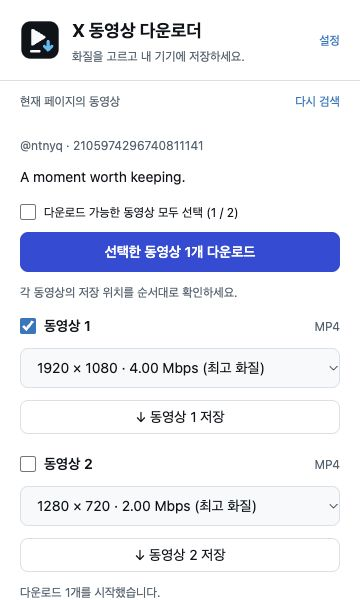
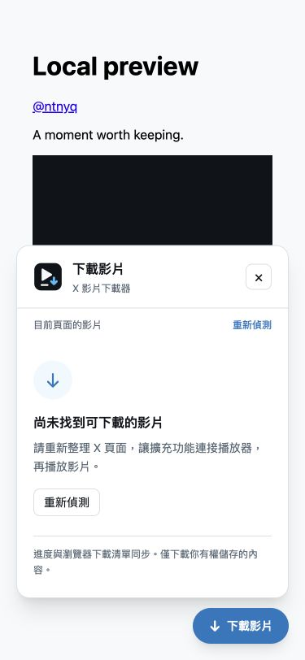
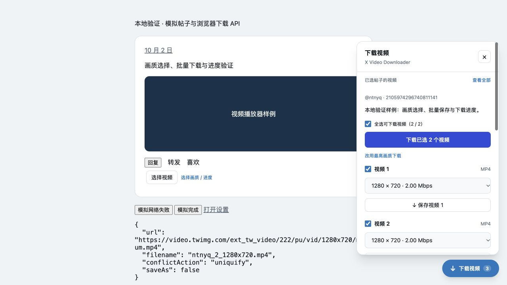
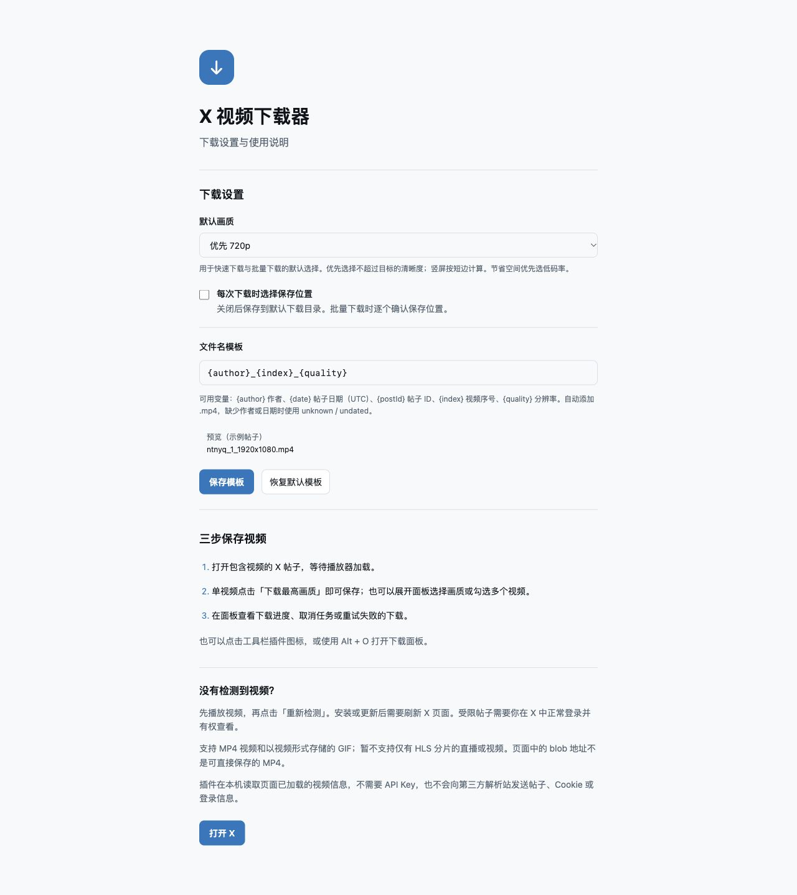

# X Video Downloader


基于 **WXT + Vue 3 + TypeScript + UnoCSS** 的 X / Twitter 视频下载插件。

## 功能

- 自动在视频帖子下方添加「下载视频」，右下角始终保留下载入口。
- 工具栏弹窗列出当前页面已检测到的视频，支持多视频与 GIF 视频。
- 单视频一键下载；默认最高画质，可设置优先 1080p、720p 或节省空间，竖屏按短边计算。
- 同帖多视频支持全选 / 勾选批量保存，HLS-only 视频自动排除。
- 自定义文件名模板：`{author}`、`{date}`、`{postId}`、`{index}`、`{quality}`，支持即时预览与校验。
- 显示真实下载字节数、百分比和完成 / 失败状态，支持取消与重试。
- 使用浏览器下载管理器保存文件，支持选择保存位置和文件重名处理。
- 动态加载、切换帖子与引用帖分别保留视频归属；脚本启动顺序不影响已捕获数据的回放。
- `Alt + O` 打开或关闭下载面板。
- 界面支持英文、简体中文、繁体中文、日文和韩文，自动跟随浏览器语言。

## 安装与使用

### Chrome / Edge

需要 Chromium 111 或更新版本。

1. 执行 `pnpm install` 和 `pnpm build`。
2. 在浏览器扩展管理页开启「开发者模式」。
3. 选择「加载已解压的扩展程序」，加载 **`dist/chrome-mv3`**。
4. **刷新已打开的 X 页面**，必要时播放一下视频。
5. 单视频点击「下载最高画质」；多视频点击「选择视频」，勾选后批量保存。
6. 点击「选择画质 / 进度」或右下角「下载视频」，查看任务进度、取消或重试。

更新代码后重新构建，在扩展管理页点击重新加载，再刷新 X 页面。旧原型和此插件同时启用时可能出现两个按钮，建议关闭旧原型。

`pnpm zip` 输出可解压加载的插件包到 `dist/`。

### Firefox

需要 Firefox 140 或更新版本。执行 `pnpm build:firefox`，在 `about:debugging#/runtime/this-firefox` 中加载 `dist/firefox-mv3/manifest.json` 进行临时测试；临时扩展在重启后失效。正式分发需要 Mozilla 签名。

## 工作原理

`capture.content.ts` 在页面开始加载时运行于 MAIN world，只观察 X 自己发起的 fetch / XHR 响应，从帖子媒体数据中提取 `video_info.variants`。不主动调用 X 私有接口，不读取或转发认证令牌，不需要 API Key、后端或第三方解析站。

隔离环境中的 content script 校验这些记录，通过 Shadow DOM 挂载 Vue 界面，避免影响 X 的样式。页面播放器暴露直接 MP4 地址时也能作为补充来源。用户点击保存后，background 再次校验发送方、帖子 ID 和下载 URL，调用原生下载 API。

检测到的视频列表只缓存在当前页面内存中，最多保留 250 条帖子。画质、保存位置和文件名偏好写入本地扩展存储。为恢复进度与支持重试，本地也会保存本插件创建的下载 ID、视频地址、文件名及帖子元数据；达到清理阈值后删除较早的已结束任务，保留进行中的下载，不读取或显示其他来源的下载历史。

面板打开时按秒查询原生下载进度；总大小未知时显示已下载字节数，不生成虚假百分比。关闭面板或弹窗不影响已开始的浏览器下载。批量保存按顺序创建下载；开启“每次选择保存位置”时逐个弹窗，取消其中一个不会阻止后续视频。

文件名中的 `{date}` 是帖子的 UTC 日期。缺少作者 / 日期时分别使用 `unknown` / `undated`；自动添加 `.mp4` 并由浏览器处理重名。

相关官方文档：[WXT Content Scripts](https://wxt.dev/guide/essentials/content-scripts)、[downloads.download](https://developer.mozilla.org/en-US/docs/Mozilla/Add-ons/WebExtensions/API/downloads/download)、[Firefox MAIN world](https://blog.mozilla.org/addons/2024/07/10/manifest-v3-updates-landed-in-firefox-128/)、[Firefox 数据声明](https://extensionworkshop.com/documentation/develop/firefox-builtin-data-consent/)。

## 权限

| 权限 / 站点范围                                | 用途                                       |
| ---------------------------------------------- | ------------------------------------------ |
| `downloads`                                    | 将选中的 MP4 加入浏览器下载列表            |
| `storage`                                      | 保存下载偏好、文件名模板和本插件的任务记录 |
| `activeTab`                                    | 用户打开弹窗或按快捷键时识别当前标签页     |
| `https://*.x.com/*`、`https://*.twitter.com/*` | 注入视频捕获脚本和下载按钮                 |

下载仅接受 `https://video.twimg.com/` 下的 MP4 地址。移除了模板的全站注入、`tabs`、`contextMenus` 和可选通知权限。Firefox manifest 声明不收集个人数据。

## 已知限制与排查

- 目前支持直接 MP4；**不合并 HLS 分片**，不下载仅提供 HLS 的直播流。遇到这类视频会明确显示说明。
- `blob:` 是播放器的临时对象地址，不是完整视频下载地址；插件从页面响应中寻找原始 MP4。
- 安装前已经完成的请求无法被捕获，安装或更新后必须刷新 X 页面。
- 没有结果时，先播放视频，再点击「重新检测」；仍无结果则刷新页面。
- 受限帖子必须在你的登录状态下正常可见，插件不会绕过访问限制。
- X 的响应格式和页面结构不是稳定接口，发生变更后可能需要更新解析和选择器。
- 下载任务创建后会显示实际进度。失败重试使用原视频地址；如果地址已过期，需要刷新原帖重新检测。面板中“已暂停”的任务可取消，继续下载请使用浏览器下载管理器。

## 语言与图标

| 语言     | Locale  |
| -------- | ------- |
| English  | `en`    |
| 简体中文 | `zh_CN` |
| 繁體中文 | `zh_TW` |
| 日本語   | `ja`    |
| 한국어   | `ko`    |

五种语言均覆盖扩展名称、简介、快捷键说明、弹窗、帖子按钮、下载面板、设置、欢迎页与应用错误提示。使用浏览器原生 [i18n](https://developer.chrome.com/docs/extensions/reference/api/i18n) 选择语言，不支持的语言回退到英文；修改浏览器界面语言后，重新打开扩展页面并刷新 X 页面。浏览器返回的原始错误代码保留，便于排查。

翻译源文件位于 `locales/`。新增语言时复制 `en.yaml`，保留所有键名和 `$1` 等占位符；文件名模板变量不参与翻译。`pnpm test` 会检查语言键、占位符、文档语言和错误提示的完整性。

图标以深色圆角底、白色播放符号和蓝色下载箭头组成。`assets/images/downloader.svg` 是唯一源文件，WXT 自动生成浏览器需要的 PNG 尺寸；弹窗、下载面板、设置、欢迎页与 favicon 共用该图标。

## 开发与检查

使用 `package.json` 中固定的 pnpm 版本。

通用排序、去重、JSON 解析、字节换算及串行批量任务使用 `@ntnyq/utils`。视频来源与下载请求校验仍由领域函数处理；批量保存保持单个对话框依次确认，取消或失败后继续处理后续视频。

```sh
pnpm dev
pnpm dev:firefox

pnpm test
pnpm format:check
pnpm lint
pnpm typecheck
pnpm build
pnpm build:firefox
```

测试使用现有 `tsx` 与 Node.js 内置测试运行器，没有引入新的测试框架。覆盖 URL 与消息校验、真实捕获入口启动、fetch 响应不被消耗、跨脚本回放、嵌套引用帖、作者和日期、多视频、画质策略、文件名安全、批量请求、HLS 降级、下载进度恢复、取消重试与部分失败。

多语言改动另以本地模拟浏览器 API 检查日文设置保存与文件名校验、韩文批量选择和下载反馈、繁体中文内容面板的窄屏布局。以下截图为模拟页面，不代表已完成真实 X 视频下载或 Firefox 实机验证。







本地浏览器已使用**模拟帖子和模拟浏览器 API**检查构建后的按钮、面板、一键下载、批量勾选、画质偏好、文件名校验与保存、进度恢复、取消重试、错误状态、帖子切换、设置与欢迎页。目标 X 页面的访问超时，**真实登录会话中的视频下载以及 Firefox 实机行为仍需验证**。





## License

[MIT](./LICENSE) License © 2026 to PRESENT [ntnyq](https://github.com/ntnyq)
