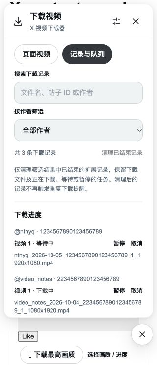

# X Video Downloader


A browser extension for downloading videos from X / Twitter, built with **WXT + Vue 3 + TypeScript + UnoCSS**.

## Features

- Automatically adds download buttons below video posts, with a persistent download button in the bottom-right corner.
- Lists videos detected on the current page in the toolbar popup, including multiple videos and GIFs stored as video.
- Downloads a single video with one click. Uses the best quality by default, with options to prefer 1080p, 720p, or smaller files. Portrait video resolution is measured by the shorter edge.
- Select videos across posts on the current page, with shared page, post, and individual selections and per-video quality choices. Each batch accepts up to 100 videos; HLS-only entries remain visible but cannot be selected.
- Manage a persistent download queue with 1–6 concurrent transfers (default: 3), pause, resume, cancellation, and retry. Waiting tasks survive background restarts.
- Search download history by filename, post ID, or author, filter by author, and clear individual or matching finished records. Completed videos require confirmation before downloading again.
- Custom filename templates with `{author}`, `{date}`, `{postId}`, `{index}`, and `{quality}`, plus instant previews and validation.
- Displays actual downloaded bytes, percentages, and completion or failure status, with cancellation and retry support.
- Uses the browser's download manager and saves directly to its download folder by default. Optionally prompts for a save location for each download. Duplicate filenames receive a numeric suffix automatically.
- Keeps videos associated with their original posts across dynamic loading, post navigation, and quoted posts. Captured data can be replayed regardless of script startup order.
- Opens or closes the download panel with `Alt + O`.
- Supports English, Simplified Chinese, Traditional Chinese, Japanese, and Korean, automatically following the browser's language.

## Installation and Usage

### Chrome / Edge

Requires Chromium 111 or later.

1. Run `pnpm install` and `pnpm build`.
2. Enable **Developer mode** on your browser's extensions page.
3. Select **Load unpacked** and load **`dist/chrome-mv3`**.
4. **Reload any open X pages** and play the video if needed.
5. For a single video, click **Download best quality**. For multiple videos, click **Select videos**, choose the videos, and download them together.
6. Click **Quality / progress** or **Download videos** in the bottom-right corner to view progress, cancel downloads, or retry them.

After updating the code, rebuild the extension, reload it on the extensions page, and refresh X. If an older prototype is enabled alongside this extension, duplicate buttons may appear; disable the older prototype.

`pnpm zip` creates an extension archive in `dist/` that can be extracted and loaded as an unpacked extension.

### Firefox

Requires Firefox 140 or later. Run `pnpm build:firefox`, then load `dist/firefox-mv3/manifest.json` at `about:debugging#/runtime/this-firefox` for temporary testing. Temporary extensions are removed when Firefox restarts. Distribution requires signing by Mozilla.

## How It Works

`capture.content.ts` runs in the MAIN world when the page starts loading. It only observes fetch / XHR responses initiated by X itself and extracts `video_info.variants` from post media data. It does not call X's private APIs or read or forward authentication tokens. No API key, backend, or third-party video extraction service is required.

The isolated content script validates these records and mounts the Vue interface inside a Shadow DOM to avoid affecting X's styles. Direct MP4 URLs exposed by the page's video player can serve as an additional source. When the user saves a video, the background script validates the sender, post ID, and download URL again before calling the native downloads API.

Detected videos are cached only in the current page's memory, with a limit of 250 posts. Quality, concurrency, save location, filename preferences, and the floating button’s last docked position are saved in local extension storage. The button restores its position after a reload and stays within the current window. To restore progress and support retries, the extension also stores the download IDs, video URLs, filenames, and post metadata for downloads it creates. The newest 200 finished records are retained alongside up to 1,000 queued, paused, or active tasks. Older finished records are removed automatically; clearing history also removes its duplicate-download reminders. Download history from other sources is neither read nor displayed.

While the panel is open, native download progress is polled once per second. When the total size is unknown, the interface shows downloaded bytes without inventing a percentage. Closing the panel or popup does not affect browser downloads already in progress. Single and batch downloads save directly to the browser's download folder by default. You can change this folder in browser settings (Chrome: `chrome://settings/downloads`). Browser download calls are made sequentially so save dialogs do not overlap. Transfers run up to the configured concurrency limit, with the remaining tasks waiting in a FIFO queue. Paused transfers release a slot; resuming waits for an available slot. Native download events advance the queue even when the panel is closed. Lowering the limit leaves existing transfers running and delays new ones. Enabling **Choose a save location for each download** in the extension settings opens a separate dialog for each video; cancelling one does not prevent subsequent downloads. Updates preserve saved preferences. If a save dialog still appears for every download, turn this option off.

The `{date}` filename variable uses the post's UTC date. Missing authors and dates fall back to `unknown` and `undated`, respectively. The `.mp4` extension is added automatically, and the browser handles duplicate filenames.

Related official documentation: [WXT Content Scripts](https://wxt.dev/guide/essentials/content-scripts), [downloads.download](https://developer.mozilla.org/en-US/docs/Mozilla/Add-ons/WebExtensions/API/downloads/download), [Firefox MAIN world](https://blog.mozilla.org/addons/2024/07/10/manifest-v3-updates-landed-in-firefox-128/), and [Firefox data collection declarations](https://extensionworkshop.com/documentation/develop/firefox-builtin-data-consent/).

## Page Batches, Queue, and History

Open the toolbar popup or the floating panel. **Page videos** shares one selection across the visible posts: use the page checkbox, each post checkbox, or individual video checkboxes, then choose **Download selected videos**. Manual quality choices apply to both batch and individual downloads. Opening a panel from a post limits selection to that post until **Show all** is selected. Selections above 100 remain visible, with downloading disabled until the batch is reduced.

**History & queue** remains available from the popup on non-X tabs too. Search filenames, post IDs, and authors, or use the author filter. Pause, resume, cancel, and retry only affect downloads created by this extension. **Clear finished records** clears finished records matching the current filters; it keeps saved files, native browser history, and all queued, active, or paused tasks. A single record can also be removed. The newest 200 finished records are retained automatically.

Duplicate reminders use the post ID and media position, including when a different quality or refreshed URL is chosen. Confirming repeats only the completed items from the last selection; successful new downloads are not submitted again. Concurrent clicks reuse an existing active or queued task for that video.

HLS remains an assessment deliverable for this iteration. See [HLS feasibility and staged implementation](docs/hls-feasibility.md) for format handling, browser lifecycle, resource limits, licensing, and acceptance criteria. No HLS permission or segment downloader has been added.

## Permissions

| Permission / Site Scope                        | Purpose                                                                |
| ---------------------------------------------- | ---------------------------------------------------------------------- |
| `downloads`                                    | Add selected MP4 files to the browser's download list                  |
| `storage`                                      | Save download preferences, filename templates, and extension task data |
| `activeTab`                                    | Identify the current tab when the popup or keyboard shortcut is used   |
| `https://*.x.com/*`, `https://*.twitter.com/*` | Inject video capture scripts and download buttons                      |

Downloads accept only MP4 URLs under `https://video.twimg.com/`. The template's all-site injection, `tabs`, `contextMenus`, and optional notification permissions have been removed. The Firefox manifest declares that no personal data is collected.

## Known Limitations and Troubleshooting

- Currently supports direct MP4 files. **HLS segments are not merged**, and live streams available only through HLS cannot be downloaded. The interface explains this when such a video is detected.
- A `blob:` URL is a temporary object URL used by the player, not a complete video download URL. The extension looks for the original MP4 in page responses.
- Requests completed before installation cannot be captured. Reload X after installing or updating the extension.
- If no videos are found, play the video and click **Scan again**. If there are still no results, reload the page.
- Restricted posts must already be accessible in your signed-in session. The extension does not bypass access restrictions.
- X's response formats and page structure are not stable interfaces. Changes may require updates to the parser and selectors.
- Actual progress is displayed once a download task is created. Retrying a failed download reuses the original video URL. If it has expired, reload the original post and scan again. Tasks marked **Paused** can be resumed or cancelled in the panel. If the background stops during an uncertain native download handoff, the task is marked failed with `START_INTERRUPTED` and requires an explicit retry; check the browser download list first to avoid repeating a transfer it may already have accepted.

## Languages and Icon

| Language            | Locale  |
| ------------------- | ------- |
| English             | `en`    |
| Simplified Chinese  | `zh_CN` |
| Traditional Chinese | `zh_TW` |
| Japanese            | `ja`    |
| Korean              | `ko`    |

All five languages cover the extension name, description, keyboard shortcut description, popup, post buttons, download panel, settings, welcome page, and application error messages. Language selection uses the browser's native [i18n](https://developer.chrome.com/docs/extensions/reference/api/i18n) API, falling back to English for unsupported languages. After changing the browser's interface language, reopen extension pages and reload X. Original error codes returned by the browser are preserved for troubleshooting.

Translation source files are in `locales/`. To add a language, copy `en.yaml` and preserve all keys and placeholders such as `$1`. Do not translate filename template variables. `pnpm test` checks translation keys, placeholders, document language declarations, and error message completeness.

The icon combines a dark rounded background, a white play symbol, and a blue download arrow. `assets/images/downloader.svg` is the single source file, and WXT automatically generates the PNG sizes required by browsers. The popup, download panel, settings, welcome page, and favicon share this icon.

## Development and Checks

Use the pnpm version pinned in `package.json`.

General sorting, deduplication, JSON parsing, byte formatting, and sequential batch tasks use `@ntnyq/utils`. Domain-specific functions handle video source and download request validation. When save dialogs are enabled, batch downloads prompt for one video at a time and continue with subsequent videos after a cancellation or failure.

```sh
pnpm dev
pnpm dev:firefox

pnpm test
pnpm format:check
pnpm lint
pnpm typecheck
pnpm build
pnpm build:firefox
```

Tests use the existing `tsx` dependency and Node.js's built-in test runner, with no additional test framework. Coverage includes persistent queue recovery, concurrency limits, cross-post selection and batching, duplicate confirmation, history search and cleanup, pause/resume ownership, stale UI responses, URL and message validation, startup of the actual capture entrypoint, preserving fetch response bodies, replay across scripts, nested quoted posts, authors and dates, multiple videos, quality selection, filename safety, batch requests, HLS fallback behavior, download progress recovery, cancellation, retries, and partial failures.

Localization changes were also checked locally with mocked browser APIs: saving settings and validating filenames in Japanese, batch selection and download feedback in Korean, and the Traditional Chinese content panel at narrow widths. The following screenshots show mocked pages and do not establish that real X video downloads or behavior in Firefox have been verified.


The built extension has been checked in a local browser using **mocked posts and browser APIs**, covering buttons, panels, one-click downloads, batch selection, quality preferences, filename validation and saving, progress recovery, cancellation, retries, error states, post navigation, settings, and the welcome page. On 2026-10-05, the expanded UI was checked against the actual production background bundle with mocked native APIs: cross-post batches, duplicate confirmation, pause/resume, history search/author filters/cleanup, selection retention between views, the 100-video limit, history on non-X tabs, persisted concurrency settings, and a 320px content panel. **109 automated tests, formatting, lint, typecheck, and both browser builds pass.** A signed-in X page was reachable during this session, but the new extension was not installed there; **real signed-in downloads and Firefox runtime behavior remain unverified**.




## License

[MIT](./LICENSE) License © 2026 to PRESENT [ntnyq](https://github.com/ntnyq)
