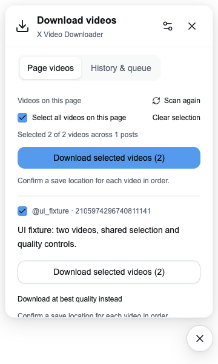
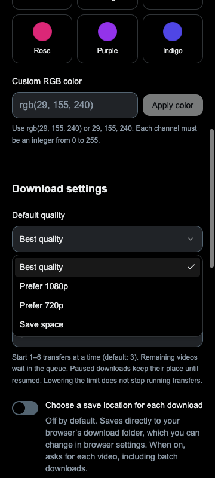
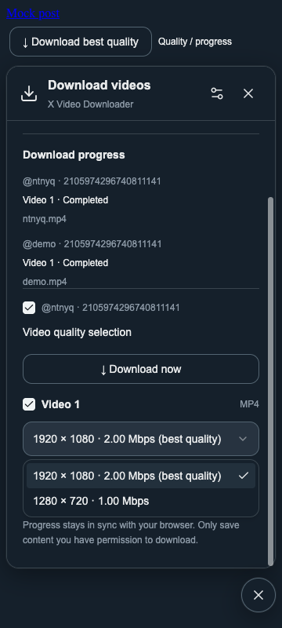

# Themes

Open **Settings → Appearance** from the toolbar popup or the floating panel.
Grok is the default: neutral surfaces and an adaptive black/white primary button.
The 12 presets change the accent; custom RGB colors also work. Choices are saved
locally and synchronized across open extension surfaces. Custom button text
automatically uses black or white, whichever has the higher contrast.

Accepted input: `rgb(29, 155, 240)`, `rgb(29 155 240)`, or `29, 155, 240`.
Channels must be integers between 0 and 255; alpha and arbitrary CSS are rejected.
Click **Apply color** to save a custom color. Click **Grok · Default** to reset.

Panels and inline controls on X follow its visible light, dim, or black background.
The toolbar popup, settings, and welcome page follow the system color scheme.

## CSS overrides

Public variables override the saved accent and built-in surface defaults. Set them
on `:root` for extension pages, or on the shadow hosts with a user stylesheet on X:

```css
x-video-downloader,
x-video-download-button {
  --xvd-accent: rgb(29, 155, 240);
  --xvd-on-accent: #000;
  --xvd-background: #fff;
  --xvd-input: #eff3f4;
  --xvd-ink: #0f1419;
  --xvd-line: #eff3f4;
}
```

| Variable             | Role                                     |
| -------------------- | ---------------------------------------- |
| `--xvd-accent`       | Primary actions, selection and progress  |
| `--xvd-on-accent`    | Text and icons on the accent background  |
| `--xvd-background`   | Panel and page background                |
| `--xvd-surface`      | Secondary surfaces and previews          |
| `--xvd-input`        | Input background and selected theme tile |
| `--xvd-ink`          | Main text and icon buttons               |
| `--xvd-muted`        | Secondary text                           |
| `--xvd-line`         | Dividers and panel outline               |
| `--xvd-control-line` | Input and secondary button borders       |
| `--xvd-hover`        | Neutral button hover background          |
| `--xvd-danger`       | Error text                               |
| `--xvd-shadow`       | Floating panel and launcher shadow       |

When overriding the accent in CSS, also set `--xvd-on-accent` to a readable color;
automatic foreground selection applies to colors saved through Settings.
Variables prefixed `--xvd-default-*` and `--xvd-theme-*` are internal fallbacks.

## UI implementation

`assets/tailwind.css` is the shared Tailwind CSS v4 entry point. It maps shadcn
semantic colors to the public variables above; `assets/theme.css` owns the light,
dim, and dark fallbacks. WXT injects content styles into each shadow root using
`cssInjectionMode: 'ui'`, so the Tailwind reset does not affect X. `assets/shadow-properties.css` initializes
Tailwind properties inside the shadow tree because Chromium does not register
shadow-root `@property` declarations. Recheck these defaults when upgrading Tailwind.

The local components in `components/ui` follow the shadcn-vue structure used by
`prettier-now`. `components.json` configures future additions, and `lib/utils.ts`
combines conditional classes with Tailwind-aware conflict resolution. Select menus
use a theme-local portal container provided by `useOverlayTarget`, keeping content
inside the shadow root and outside the panel's scrolling container. Escape closes
the menu before the containing panel. Save-location preferences use Switch, and
form controls share Label. The draggable launcher retains a native button for pointer capture.

Settings and welcome pages share one Sonner toaster each. Validation and storage
errors stay beside their controls. Runtime diagnostics use scoped `consola/browser`
loggers from `utils/logger.ts`; production logs warnings and errors, while development
also enables debug messages. Never log captured response bodies or credentials.

## Migration checks

The shadcn migration was checked in an isolated Chromium extension session:
settings persisted across page loads, a 320px dark settings page had no horizontal
overflow, and axe reported no WCAG 2A/2AA violations there. Popup tabs support arrow
keys. A controlled two-video fixture exercised mixed checkbox states, selection
retention across tabs, and Escape/focus restoration in an independent shadow root
with all document styles removed. This fixture does not verify live X capture or
real downloads. Firefox was build-checked only.




The Select refactor was checked with mocked extension APIs in Chromium: repeated
quality/concurrency changes, failed-save rollback, author filtering and clearing,
selected quality in download requests, and pointer/Escape interactions inside the
content-script shadow root. Both menus fit within a 360px dark viewport. These
checks do not verify real X downloads or Firefox runtime behavior.




